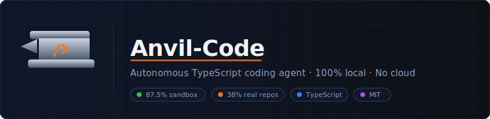
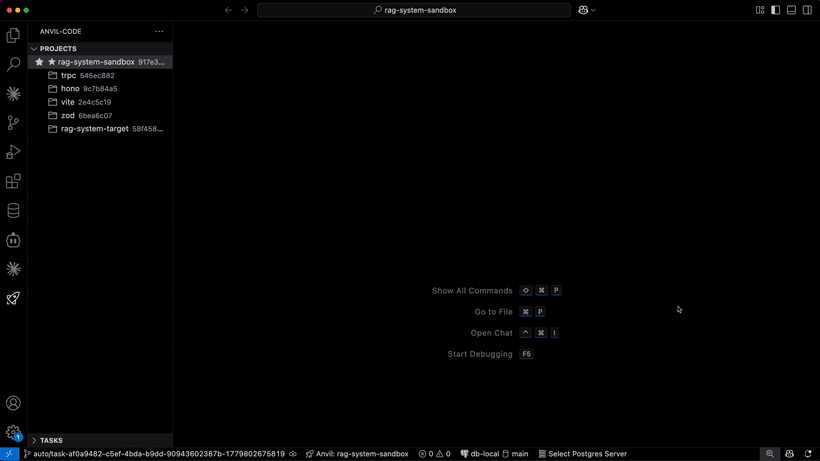

<p align="center">
  
</p>

<p align="center">
  <a href="LICENSE"></a>
  
  
  
  
  
  
  
</p>

<p align="center">
  <em>Anvil-Code — local autonomous coding agent for TypeScript. Submits tasks, plans, writes code, validates, and commits.<br/>
  Runs on your own GPU. No cloud. No subscriptions. No telemetry.</em>
</p>

```
POST /task → Planner → Architect → Coder → Tester → Reviewer → Fixer ×3 → git commit
```

<p align="center">
  
  <br/>
  <em>Submit task → live SSE stream → commit. See <a href="docs/SETUP.md">docs/SETUP.md</a> to reproduce.</em>
</p>

---

## Benchmark

> Latest numbers from v1.65d (2026-05-20). Raw data: [BENCHMARK.md](BENCHMARK.md)

### By target codebase

| Target | Files | Tasks | 🟢 Pass | 🔴 Fail | Rate |
|--------|-------|-------|---------|---------|------|
| `rag-system-sandbox` (curated) | ~30 | 16 | **14** | 2 | 🟢 **87.5 %** |
| `honojs/hono` (real OSS) | 366 | 6 | **6** | 0 | 🟢 **100 %** |
| `trpc/trpc` (real OSS) | 907 | 6 | **5** | 1 | 🟢 **83 %** |
| **Combined real-repo** | | **12** | **11** | 1 | 🟢 **92 %** |
| `vitejs/vite` (cross-repo) | monorepo | 6 | **6** | 0 | 🟢 **100 %** |
| `colinhacks/zod` (cross-repo) | library | 4 | **4** | 0 | 🟢 **100 %** |

### By task category (sandbox)

| Category | Description | Sandbox | Combined | Rating |
|----------|-------------|---------|----------|--------|
| **A — Additive** | New file, new endpoint, new service | 4 / 4 | 6 / 6 | 🟢 **100 %** |
| **B — Structural** | Class extraction, generic refactor | 2 / 2 | 4 / 4 | 🟢 **100 %** |
| **C — Algorithmic** | LRU, TTL, SSE, auth logic | 2 / 2 | 3 / 3 | 🟢 **100 %** |
| **D — Maximum** | CQRS, architectural split, cross-file | 1 / 2 | 1 / 3 | 🔴 **33 %** |
| **Total** | | **9 / 10** | **14 / 16** | 🟢 **87.5 %** |

### By number of files touched

| Files changed | Success rate | Note |
|---|---|---|
| 1 – 2 | 🟢 ~100 % | Near-perfect; scope fits context |
| 3 – 4 | 🟢 ~85 % | Good; minor integration misses |
| 4 – 5 new abstractions | 🟡 ~70 % | Reviewer becomes the gating factor |
| 5 + architectural | 🔴 ~30 % | Context or scope overrun |

### Real-repo progress (v1.38 → v1.65d)

| Metric | v1.38 (2026-05-13) | v1.65d (2026-05-20) | Δ |
|---|---|---|---|
| Real-repo success rate | 🟡 **42 %** (5/12) | 🟢 **92 %** (11/12) | **+50 pp** |
| `ts_fail` (bad workspace imports) | 🔴 29 % | 🟢 0 % | Monorepo meta injection (v1.38 D2) |
| `reviewer_reject` | 🔴 29 % | 🟢 ~8 % | BUGFIX_SPEC Fixer dispatch (v1.39-c) + lenient prompt (v1.65a) |
| `no_op` (Coder 0 changes) | 🔴 14 % | 🟢 0 % | NoopStep retry + `add_type_member` AST tool (v1.65b) |
| `llm_parse_fail` | 🔴 14 % | 🟢 ~4 % | Planner + Architect retry (v1.41) |
| `validation_incomplete` | 🔴 14 % | 🟢 0 % | Validation timeout guard (v1.39-b) |
| TestRunner timeout (large monorepos) | 🔴 timeout at 60s | 🟢 commits | 60s → 120s (v1.65c) |

### Cumulative mode (sequential tasks, building on each other)

Sequential tasks on sandbox, each forking from `auto/cumulative` (accumulated state of all prior committed tasks).

**Gemma 4 26B baseline (v1.42, 6 tasks):**

| Task | Description | Result |
|------|-------------|--------|
| C1 | DELETE /users/:id endpoint | 🟢 commit |
| C2 | Email filter on GET /users | 🟢 commit |
| C3 | updatedAt field + PATCH endpoint (3 files) | 🟢 commit |
| C4 | Pagination with { users, total } format | 🟢 commit |
| C5 | TTL sessionExpiry + POST /session (3 files) | 🟢 commit |
| C6 | Rate limiting in server.ts | 🟢 commit |

**6/6 ✅** — no merge conflicts, no race conditions, no manual work between tasks.

**Qwen3-35B MoE (v1.65d, 5 tasks on fresh sandbox `907dbae`):**

L1.1 → L1.2 → L2.1 → L3.1 → L2.3 — **5/5 ✅** (`/health` + Zod validation + request-logging + class refactor + soft-delete). Confirms cumulative state holds on MoE architecture too.

### Large-file surgery (L6 bench, v1.50)

4 surgical edits in real hono files >480 LOC, exercising structural anchor v2:

| Task | File | LOC | Pattern | Result |
|------|------|-----|---------|--------|
| L6.1 | `src/request.ts` | 489 | Cache header() across 3 overloads → implementation | 🟢 commit |
| L6.2 | `src/request.ts` | 489 | JSDoc on overloaded query() method | 🟢 commit |
| L6.3 | `src/hono-base.ts` | 539 | Add public getter to Hono class | 🟢 commit |
| L6.4 | `src/context.ts` | 780 | redirect() property arrow + complex generics | 🔴 model limit |

**3/4 (75%)** — overload disambiguation works on 489-line files; complex generics in 780-line files exceed Gemma 26B capability.

---

## What it handles — and what it doesn't

| Task type | Result | Notes |
|---|---|---|
| Add new utility file / module | 🟢 ~100 % | Single-file scope, no callsite changes |
| Add Fastify route + handler | 🟢 ~95 % | Structural anchor insert works reliably |
| JSDoc / TSDoc annotation | 🟢 ~100 % | Read-only analysis, minimal writes |
| Bugfix (test → one file) | 🟢 ~90 % | Clear signal from failing test |
| LRU / TTL / algorithmic logic | 🟢 ~90 % | Model generates correct structures |
| Multi-file feature (2–4 files) | 🟢 ~90 % | 2-hop retrieval + FEATURE_SPEC guidance |
| Refactor across 5+ files | 🟡 ~50 % | N-hop reverse callers + payload filter (Qdrant planned in Phase 5) |
| Large class surgery (>700 LOC) | 🟡 ~75 % | Structural anchor v2 (overload-aware) — see L6 bench |
| Complex generics (tRPC-style) | 🟡 ~50 % | Improved via `add_type_member` (v1.65b); thinking-mode over-refactor still a risk |
| Cumulative chained tasks | 🟢 ~100 % | v1.39-a auto ff-merge; 6/6 Gemma + 5/5 Qwen3 MoE on sandbox |

### Cross-repo transferability

System tested on repos outside the hono/trpc training distribution (v1.51–v1.63):

| Repo | Type | Tasks | Result | Notes |
|------|------|-------|--------|-------|
| `colinhacks/zod` | validation library | 4 | **4/4 ✅** | After v1.51 extension detection |
| `vitejs/vite` | bundler monorepo | 6 | **6/6 ✅** | v1.63 with Qwen3-35B MoE — including 1835-line file edit |

**Pre-flight:** `GET /project/:id/healthcheck` surfaces environment issues (missing node_modules, broken vitest setup) before bench runs. Recommended workflow for new repos:
```bash
# 1. Register + index
curl -X POST /project -d '{"root":"/path/to/repo"}'
# 2. Healthcheck before bench
curl /project/<id>/healthcheck
# 3. Fix reported issues, then submit tasks
```

---

## Requirements

| Component | Minimum | Recommended |
|---|---|---|
| Node.js | 18 LTS | 20+ |
| npm | 9+ | 10+ |
| Git | 2.30+ | any recent |
| RAM | 16 GB | **32 GB** |
| GPU VRAM | 16 GB (smaller models, lower accuracy) | **24 GB** (Gemma 4 26B) |
| LLM backend | llama-server / any OpenAI-compatible API | [llama-swap](https://github.com/mostlygeek/llama-swap) |
| OS | macOS 13+, Linux (Ubuntu 22.04+) | macOS M2+ or Linux CUDA |

> 24 GB GPU VRAM is what the benchmarks above are measured against.  
> 32 GB system RAM is recommended to keep OS + dev tooling running while the GPU is loaded.

### Validated model stack

Two configurations are benchmarked and both pass headline numbers — pick by hardware and preference.

**Default (v1.61+): single-model Qwen3 MoE**

| Role | Alias | Model | VRAM |
|---|---|---|---|
| Coder / Fixer / Architect / Planner / Reviewer / Tester | `qwen3-32k` | qwen3-35B-A3B MoE (3 B active, 32K ctx) | ~22 GB |
| Embeddings | `embed` | nomic-embed-text-v1.5 (768 dim) | ~0.1 GB |
| Reranker *(optional)* | `reranker` | bge-reranker-v2-m3 | ~0.4 GB |

Active default since v1.61. Thinking mode, ~11 tok/s on RTX 3090 at real-agent context. Set `LLM_LARGE_MODEL=qwen3-32k`.

**Alternative (v1.43 peak): Gemma 4 26B + Qwen3 small**

| Role | Alias | Model | VRAM |
|---|---|---|---|
| Coder / Fixer / Architect | `gemma` | gemma-4-26b-a4b-it-mxfp4-MoE ctx-32k | ~14 GB |
| Planner / Reviewer / Tester | `qwen3` | qwen3-35B-A3B MoE (3 B active) | ~22 GB |
| Embeddings | `embed` | nomic-embed-text-v1.5 (768 dim) | ~0.1 GB |

Used for the original v1.43 peak (hono 6/6, trpc 5/6). Holds 87.5 % sandbox + 92 % real-repo. Set `LLM_LARGE_MODEL=gemma`.

llama-swap auto-loads models in VRAM on demand and unloads idle ones — both configurations fit on a 24 GB card with q4_0 KV cache compression.

---

## Quickstart

### 1. Run an LLM backend

Install [llama-swap](https://github.com/mostlygeek/llama-swap), point it at your GGUFs, declare the aliases above, and start the proxy. Full setup guide: [docs/SETUP.md](docs/SETUP.md).

### 2. Clone, install, build

```bash
git clone https://github.com/BubnovSA/anvil-code.git
cd anvil-code
npm install && npm run build
```

### 3. Configure

```bash
cp .env.example .env   # every variable is documented inline
```

Key variables:

```env
LLM_URL=http://localhost:8080   # llama-swap endpoint
LLM_LARGE_MODEL=qwen3-32k       # active default since v1.61 (11 tok/s, thinking mode)
# LLM_LARGE_MODEL=gemma         # alternative: original v1.43 peak stack
PROJECT_ROOT=/path/to/your/repo
```

### 4. Start

```bash
npm run start
# → http://localhost:3000
curl http://localhost:3000/health
```

### 5. Submit a task

**VS Code extension** *(recommended)*:

```bash
cd packages/vscode-extension && npm run package
# Install the .vsix → Extensions → ⋯ → Install from VSIX
```

Run **Anvil-Code: Submit Task** from the command palette. Pick project, pick mode, watch SSE stream in the output channel.

**curl**:

```bash
# One-time: register the project
curl -X POST http://localhost:3000/project \
  -H "Content-Type: application/json" \
  -d '{"root": "/path/to/your/repo"}'

# Submit
curl -X POST http://localhost:3000/task \
  -H "Content-Type: application/json" \
  -d '{"task": "Add request-id middleware", "project": "<id>", "mode": "balanced"}'

# Stream events live
curl -N http://localhost:3000/task/<task_id>/stream
```

---

## How it works

The pipeline is fully deterministic — every step is logged and events stream to the VS Code output channel in real time.

1. **Planner** — decomposes the task into a typed DAG of steps (`feature` / `bugfix` / `refactor`)
2. **Architect** — decides which files need creating, modifying, or deleting
3. **Coder** *(tool-calling)* — reads files, applies edits via `read_file` / `replace_in_file` / `create_file` / `delete_file`
4. **Tester** — generates tests for new code (vitest / jest based on project conventions)
5. **Validation** — TypeScript check (filtered to changed production files) → test run
6. **Fixer** — retries up to 3× on failures, targeting exact compiler errors and test output
7. **Reviewer** — final lenient gate: blocks only on runtime bugs, not style
8. **Git Engine** — commits to `auto/task-*` branch; skips commit if validation never converged

Context is supplied by a **RAG Engine**: hybrid BM25 + HNSW dense retrieval (RRF merge) → 1-hop AST graph expansion → token-budgeted output.

---

## Known limitations

| Limitation | Severity | Status |
|---|---|---|
| Complex generic refactors (tRPC-style internals) | High | Limited by 32 K context + model variance on thinking-mode over-refactor; `add_type_member` (v1.65b) helps |
| Cross-service refactoring (5+ callsites) | Medium | Currently 1-hop graph traversal; multi-hop closure planned (Phase 5) |
| Large class surgery (>700 LOC) | Medium | 3/4 on hono L6 bench; 780-line files with complex generics still fail |
| HNSW JSON vector store cap ~10K items | Medium | Qdrant migration in Phase 5 |
| TypeScript / JS only (structural tools) | Medium | Python / Rust / Go parsed for context, not structurally edited |
| 24 GB VRAM ceiling → 32 B Q4 models | Hardware | Realistic ceiling: 70–80 % atomic / 30–40 % multi-file locally |
| Single machine, single user | Low | By design for local use |

---

## Documentation

| File | Contents |
|---|---|
| [BENCHMARK.md](BENCHMARK.md) | Full methodology, all task results, failure analysis |
| [docs/SETUP.md](docs/SETUP.md) | llama-swap install, model picks, hardware |
| [docs/ARCHITECTURE.md](docs/ARCHITECTURE.md) | Agent pipeline, packages, how to extend |
| [ROADMAP.md](ROADMAP.md) | Current iteration, next steps, known issues |
| [CHANGELOG.md](CHANGELOG.md) | Version history v1.0 → v1.65d |

---

## Contributing

Contributions are welcome. See [CONTRIBUTING.md](CONTRIBUTING.md) for setup and coding conventions.

The project uses a benchmark-driven approach — if you change agent behavior, run the relevant bench level against the sandbox and include results in the PR. Bench tasks are in [docs/benchmarks/tasks.md](docs/benchmarks/tasks.md).

---

## License

**MIT** — [full text](LICENSE)

In practice, this means:

- ✅ **Use freely** in personal and commercial projects
- ✅ **Modify** the source code however you like
- ✅ **Distribute** copies, modified or unmodified
- ✅ **No royalties**, no asking permission
- ⚠️ **Keep attribution** — the original license and copyright notice must appear in copies or significant portions
- ⚠️ **No warranty** — the software is provided as-is; the author is not liable for damages

Copyright © 2026 BubnovSA. Built with [llama.cpp](https://github.com/ggerganov/llama.cpp) and [llama-swap](https://github.com/mostlygeek/llama-swap).
